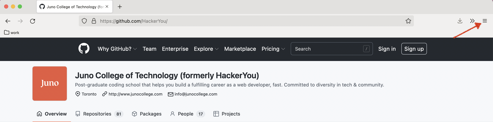
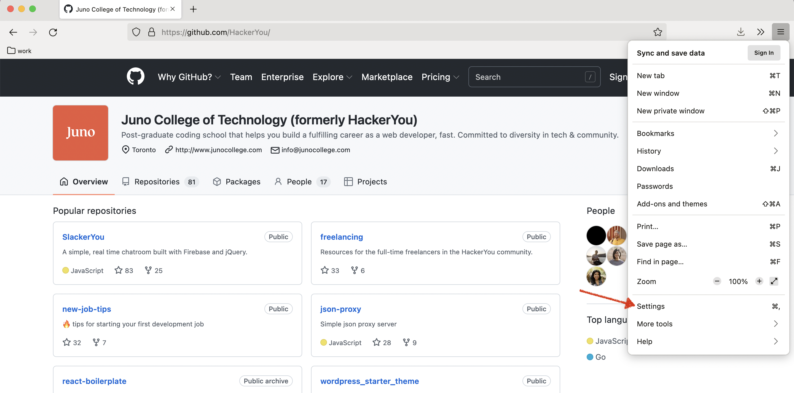
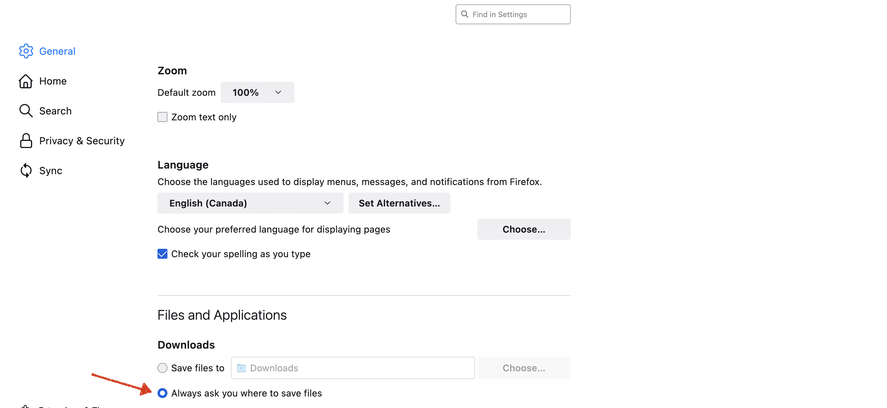

# Staying organized with code

## Choosing a download destination

Over this course, we are going to be downloading a lot of files so it would be nice to be able to choose where we want to save these files. Let’s change our browser settings so it prompts us to pick a location for our downloaded files.

**If you do not have [Firefox](https://www.mozilla.org/en-CA/firefox/new/) installed, please install this now - it will be our browser of choice for this course!**

In the top right-hand corner of your Firefox browser, click on the icon with the three vertical lines (aka the hamburger menu 🍔).

Go to "Settings" option.

Scroll to the "Files and Applications" section and click on the radio button next to "Always ask you where to save files."

In web development, projects and websites are organized within folders, and as we move forward through the course we will explore how we further organize our projects.

## Folders & naming conventions
We are going to be working with a lot of files so it's important that we create a main folder on our computers to hold everything neatly. Your future self will thank you!

As we save files on our computers, there are some naming conventions we must follow to meet best practices and make our lives easier.

The two big rules are:
* There can be no spaces in your folder or file names. It will only cause issues later on!
* Be consistent in whatever naming convention you use.

There are three options for naming conventions:
* this-is-kabob-case
* thisIsCamelCase
* this_is_snake_case

Note that none of them start with a capital letter.

### Saving files to your computer
To save exercises throughout your notes, right-click with your mouse and click on "Save Link As..."

OR

Press `option` (Mac) / `alt` (PC) **+ click** with your mouse. This will save it as a file!

## Opening a link in a new tab
To open links in a new tab (instead of them opening in the current window you're in), you can right-click with your mouse and click on "Open Link in New Tab"

OR

press `command` (Mac) / `ctrl` (PC) **+ click** with your mouse.
