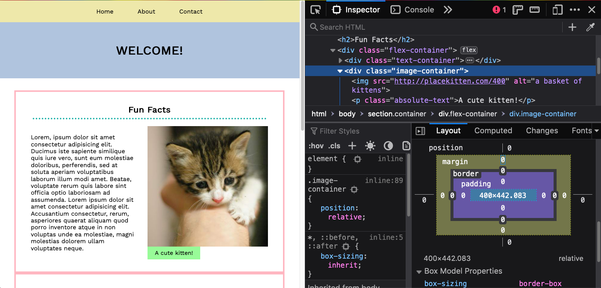
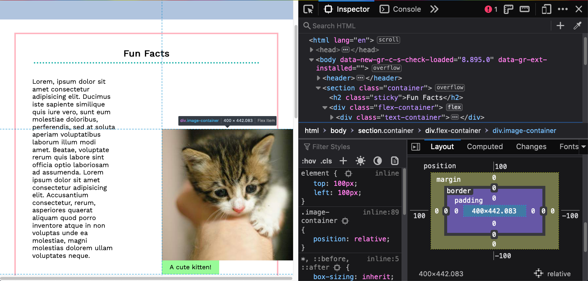
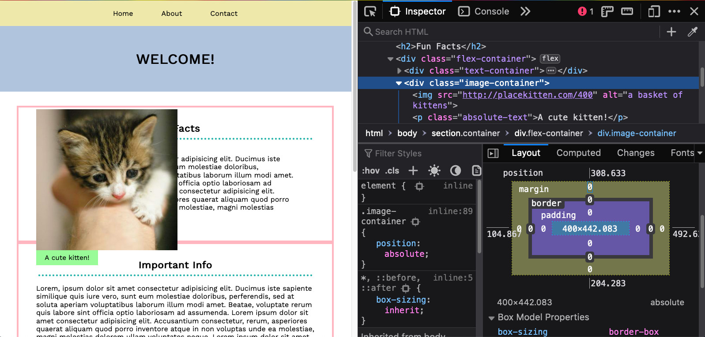
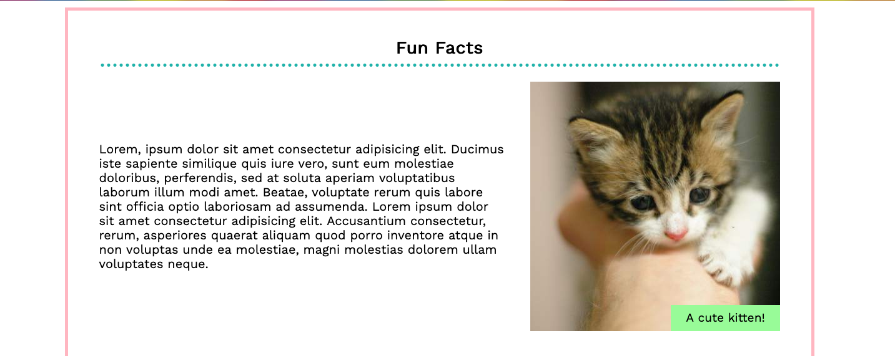

# Positioning

So far, we've been working with `flex` and `display` to create layouts, either in rows or columns. This is great for creating straight lines throughout designs, but does not allow for more granular control over elements. For example, the following issues could not be solved with `display` or `flex`:

* Bumping something up and over by a few pixels.
* Overlapping two elements or having something burst outside of its wrapper.
* Placing an element in the top right corner, regardless of how wide or tall its container is (like an 'X' at the top right of a modal box).

The CSS property `position` allows developers to create stylistic tweaks to designs that make the above examples possible. It is not a replacement for `flex` or `display` and should only be used to add "stylistic sugar" to a website - that is, special additions and fun touches that do not themselves make up a meaningful amount of content.


## Syntax

`position: <keyword>;`

When certain `position` properties are used, they unlock the `top`, `bottom`, `left` and `right` properties, which allows developers to control the final position of an element.

The `top`, `bottom`, `left` and `right` properties can accept any unit measurement value. 

```css
div {
  position: relative;
  top: 5px;
}
```

The `position` property can be applied to any element and accepts the following keywords:
* `relative`
* `absolute`
* `fixed`
* `sticky`
* `static`


## Relative

`position: relative;`

When an element is given the `position` of `relative`, it is able to move _relative_ to its own original position, using the `top`, `bottom`, `left` and `right` properties.

Download and open up [Positioning Exercise](../../exercises/positioning-exercise--conEd.html?raw=true) to practice with.

Let's start by giving the `div` with the class of `.image-container` a `position` of `relative` and open up the Firefox Developer Tools. We can see that `position` has been revealed and is sitting outside of the border property in our box model:



These values are at 0 currently, but represent `top`, `bottom`, `left` and `right`. They are only available in this example because `position: relative` has been set on the element. The coordinate values can accept any number value, including pixel, rem, em and percentage, and can also accept negative values.

If a `top` and `left` value of 100px are added to the `div` with the class of `.box`, the element will move 100px away from the top and left of its own original position.



A notable feature of an element with `position: relative` is that the space it originally occupied is kept, leaving a white space where it once was. This is called the element's _footprint_. 

A relatively positioned element moves with respect to its original position and keeps its footprint. The stacking order of all the elements is also preserved. This means all of the elements around it will behave according to the element's original position as if it hasn't moved at all.

In Dev Tools, try the following:
* Add a negative `top` value of -100px.
* Replace `top` with `margin-top`. 

What is the difference? Notice the green border on the bottom in both situations. Using `margin-top` will allow the border to stay flush with `.box`, whereas there will be white space kept when using the `top` value.


## Absolute

`position: absolute;` 

When an element is given a `position` of `absolute`, it is removed from the flow of the page and moves freely, by default basing its location with respect to the body, using the `top`, `bottom`, `left` and `right` properties.

Let's go back to our positioning exercise file and set the `div` with the class of `.image-container` to have a `position` of `absolute`, and remove the `top` and `left` values; we will see a very different behaviour compared to when the `div` was set to `relative`.



As seen in the above example, setting the `div` to `absolute` allows the element to "float", removing it from the stacking order and removing it from inside of the border. 

Try adding the property `top: 0` to `.box`. We can see that our element has broken out of its parent container and is sitting on top of several other elements at the top of the page.

Two large differences between `relative` and `absolute` positions are:
* Absolutely positioned elements look to the body, by default, to understand the properties of `top`, `bottom`, `left` and `right`, whereas relatively positioned elements move with respect to their original position.
* Absolutely positioned elements lose their footprint completely and remove themselves from the stacking order. The elements surrounding the absolutely positioned element will take up the space that was previously taken up by the element.

Try changing the `top`, `left`, `bottom` and `right` values on the `.image-container` element. Notice that the box can be positioned at any point on the screen, overlapping other content.


## Absolute and relative

Using `absolute` can be useful for moving elements around the page. However, an absolutely positioned element is basing its position off of the `body`, resulting in some very large numbers that can be hard to work with, as well as behavior that we may not want.

Let's try this out with a common web design pattern: putting a text label onto an image.

In your file, remove the `position: absolute;` CSS rule and any positon values from the `.image-container` element and instead, place it on the `.absolute-text` content:

```css
.absolute-text {
  position: absolute;
}

```

To move the text box to overlap with the bottom right corner of its container - on top of the image - we can use `absolute` positioning. Remember that using `positon: absolute` causes the element to give up its footprint on the page and allows us to move it freely in our document. We can play around with our developer tools to position the element where we want but requires some unpredictable numbers that require trial-and-error to ensure the box is in the correct position.

```css
.absolute-text {
  position: absolute;
  /* The numbers below are dependant on your screen size! */
  position: absolute;
  bottom: -54px;
  right: 247px;
}
```



Values that may work for one screen size won't necessarily be consistent across different devices and will end up causing layout issues as you resize the screen. 


This can be solved by pairing `absolute` with a parent element whose position is not `static`; we are able to anchor our absolutely positioned elements to a specific parent, and the absolutely positioned element will then have its position determined with respect to that parent, rather than the body. This makes our absolutely positioned elements more manageable and easier to work with.

In this example, `position: relative` can be given to the direct parent of the green text box, so that it will position itself based off of the `.image-container` instead of the `<body>`:

```css
.image-container {
  position: relative;
}

.absolute-text {
  position: absolute;
  bottom: 0;
  right: 0;
}
```

This method results in much more manageable numbers and the overlapping text will not move when the browser is resized! 

Note that elements which are absolutely positioned look for a point of reference by looking to their direct parent first. If the parent element does not have a position of `relative`, `fixed`, or `sticky`, the element looks to the grandparent, then the great-grandparent, etc. It will continue until it reaches the body.

## Fixed

`position: fixed;`

Similar to elements that are positioned with `absolute`, an element given a position of `fixed` uses `top`, `bottom`, `right`, and `left` to determine its position, and looks directly to the viewport to interpret the coordinates. Fixed-positioned elements also give up their footprint, meaning the content around them will take up the space previously occupied by the fixed-positioned element.

Unlike absolutely-positioned elements, fixed elements cannot have their position tied to a parent element on the page. Fixed elements will stay in the same position on the viewport, meaning they stay put as the user scrolls, relative to the browser's width and height. As a result, a popular use of fixed elements is for navigation bars that stay in the same place in the viewport as the user scrolls.


The goal is to have the `<nav>` become fixed to the top of the browser.

Our first step is to set the `<nav>` to the position of fixed and add the coordinate of `top: 0`.

```css
nav {
  position: fixed;
  top: 0;
}
```

Note that the nav's width has collapsed and is now only taking up the space of its content. This is the default behavior of fixed elements. To solve this, we can set `left` and `right` values of `0`, to stretch the element to both sides of the browser:

```css
nav {
  position: fixed;
  top: 0;
  left: 0;
  right: 0;
}
```
Or a width of 100% can be set in lieu of the right value:

```css
nav {
  position: fixed;
  top: 0;
  width: 100%;
}
```

Note that fixed position elements are considered in the same family as absolute, and some browsers will show the computed value of fixed elements' position as `absolute`.


## Sticky

`position: sticky;`

Sticky is the newest addition to the position family. A sticky element will behave like a relative-positioned element until the user scrolls to a certain point, and once that point has been reached, the element will "stick".

We would like for the first `<h2>` element to "stick" to the top of its container as we scroll past it. Create a class for the first `<h2>` element and pass it the following code:

```css
.yourClassName  {
  position: sticky;
  top: 0;
}
```

When an element is `position: sticky`, a specific position must be declared for the sticky element to understand where to "stick". In this case, we would like it to stay at the top of the container, meaning `top: 0;`.

This makes the `<h2>` a "sticky item" and its direct parent, the `<section>` element, a "sticky container". The `<h2>` will now move around only in its sticky container and never spill out of it.

For a cool effect, try changing all of the `<h2>` elements to the `position: sticky` with a `top` value of `0`.


## Browser support

`position: sticky` currently has mixed support that is improving very quickly. It does not have any support on Internet Explorer, partial support on Edge and Chrome and excellent support on Firefox and Safari. Learn more about how it is supported on [CanIUse](https://caniuse.com/#feat=css-sticky).


## Static

`position: static;`

All elements by default have a `position` value of `static`, which means that they respect their natural flow and stacking order. 

There is no need to define this position type on elements unless you are overriding existing position values.


## Exercise

Combine a hover effect with positioning to create an overlay by downloading [overlay-effect--conEd.zip here](https://hychalknotes.s3.amazonaws.com/overlay-effect--conEd.zip). The folder includes the answer key.

Download [absolute-relative-mix-exercise--conEd.zip](https://hychalknotes.s3.amazonaws.com/absolute-relative-mix-exercise--conEd.zip) to practice the relationship between relative and absolute positioned elements. The folder includes the answer key - open it up in your browser to see what to aim for.

## Resources

* [Position, MDN](https://developer.mozilla.org/en-US/docs/Web/CSS/position)
* [Absolute vs. relative vs. fixed positioning](https://css-tricks.com/absolute-relative-fixed-positioining-how-do-they-differ/)


