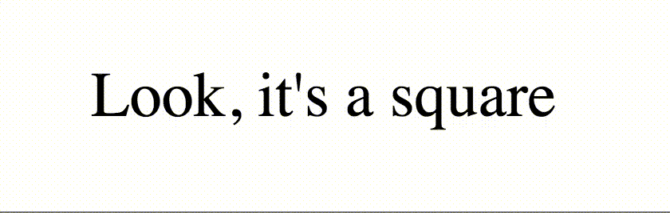

# Before and after elements

Before and after elements are a type of _pseudo-element_ used to pass in stylistic touches to content. Somewhat similarly to pseudo-classes, pseudo-elements are referenced using a pair of colons in CSS - `::before` and `::after`. It is also valid, but not ideal practice, to pass in one colon (`:before` and `:after`).

Before and after elements create inline elements before or after the content of most elements.

```html
<span class="name">Cool Person</span>
```

```css
.name::before {
  content : '☃';
}
```


As seen in the example above, before and after elements must include a `content` property, which defines the content that will be inserted either before or after the content of the original element.

Note that pseudo-elements cannot be added to self-closing elements, such as images or form inputs.

Before and after elements can also be used to create shapes. In those cases, the `content` property is left empty like in the below example:

```html
<p>Look, it's a square</p>
```

```css
p {
  font-size: 40px;
  display: flex;
  align-items: center;
}

p::before {
  content: '';
  width: 40px;
  height: 40px;
  display: inline-block;
  background: peru;
  margin-right: 10px;
}
```


Before and after elements can even be stacked with pseudo-selectors to make cool hover effects:

```css
p::before {
  content: '';
  width: 40px;
  height: 40px;
  display: inline-block;
  background: transparent;
  margin-right: 10px;
}

p:hover::before {
  content: '';
  background: peru;
}
```



## Before and after elements vs. HTML elements
Why choose to utilize pseudo-elements instead of just employing a `<span>` or `<div>`?

It's completely up to the developer to choose which route they would like to take. Some developers like to keep their HTML "clean", and prefer to keep all the stylistic elements in the CSS if they can.

Neither is more or less advanced than the other.

## Accessibility 
Before and after elements are not accessible to AT because they are not true HTML elements and therefore do not "exist" for the AT to read through.

## Exercise
A popular use for before and after elements are to create unique quotes and borders. In this exercise, we're going to practice using unique quotes around a `<blockquote>`.

Download the starter file [by clicking here](https://hychalknotes.s3.amazonaws.com/before-and-after--conEd.html) 

To see what you are working towards, check out the answer key [by clicking here](https://hychalknotes.s3.amazonaws.com/before-and-after-ANSWER--conEd.html).

Note that the curly quotes you need for the exercise are `“` and `”`.

## Resources
* [More information on replaced elements](https://developer.mozilla.org/en-US/docs/Web/CSS/Replaced_element)
* [Cool uses of before and after elements](https://css-tricks.com/pseudo-element-roundup/)
